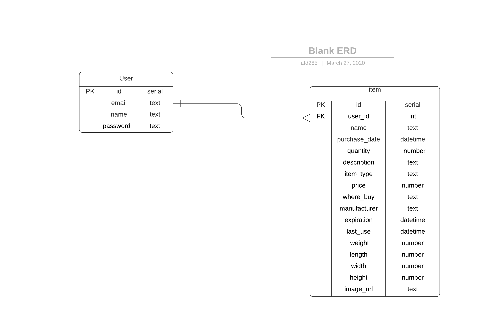

# Modeling a SQL Database

Entity - the description of some thing in your database

Record - is a single instance of an entity

Every record will have:

Created At - datetime
Updated At - datetime
Deleted At - datetime

## Entities in a Home Inventory System

- [x] User
- [ ] Manufacturer
- [ ] Item Type
- [ ] Item
- [ ] Comment
- [ ] Warranty
- [ ] Item Location
- [ ] Item Purchase Location

My database model so far-- Still WIP!

